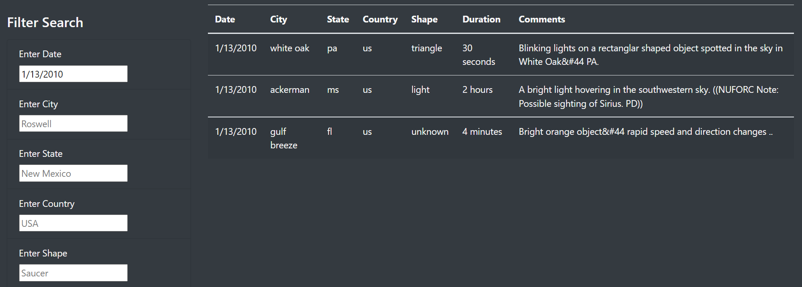

# UFOs

## Overview of Project

Our friend Dana has tasked us with building an html page to display and filter UFO data that she has in her possession in javascript format. We have put together a few basic text and design elements on the page, and built a dynamic table to display the UFO data and filter by date. Now Dana wants to be able to also filter the data by city, state, country and UFO shape.

## Results

### Welcome Screen

We have created a neat welcome screen with a large jumbotron image across, a title and a welcome text by Dana.

### UFO Data Table

Below the welcom screen, users can browse and filter our UFO data by multiple criteria: date, city, state, country and UFO shape.

### User Guide

Users can filter the data by inputting parameters in the fields on the left-hand side of the screen, then press Enter.

Make sure to input all text entries in lowercase, without spaces or hyphens. For instance, based on our search above, "Ackerman" will return "no result".

To reset the filter criteria, click the UFO Sightings at the top left of the website.

## Summary

### Drawback

Users must have a pretty good idea of what they're looking for before using the search filters. All text entries must be in lowercase, without spaces and hyphens and be spelled perfectly. Dates must be in the right format, and the filter only allows to search one date at a time. All states are abbreviated and in lowercase, so for example "Texas" can only be returned as "tx", and inputs "Texas", "TX", "texs" and " tx" will return an empty table.

### 

